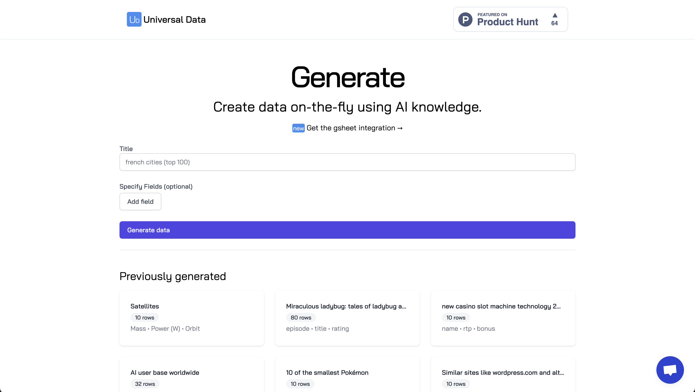

# Generate

Experience to generate data / CSV from LLM.

This is now deprecated.



## Install

### Front

```bash
cd view
yarn
```

and then

```bash
yarn dev
```

### Back

```bash
cd service
pip install -r requirements.txt
```

Add environment variables in your environment variables

```bash
- DATABASE_URL
- OPENAI_API_KEY
```
